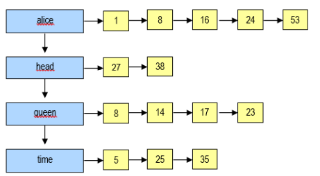

<p align="center", style="font-size: large; font-weight: bold">
Algoritmos e Estruturas de Dados I <br> 
Trabalho 2 – Geração Automática de Índice Remissivo
</p>

## Descrição: 

Este trabalho **deve ser feito em dupla ou individualmente** e consiste no desenvolvimento de uma solução para
geração automática de índice remissivo. Um índice remissivo indica em quais páginas uma determinada palavra está.<br><br>
Basicamente, é necessário realizar a leitura de um arquivo texto, e trabalhar com o armazenamento das palavras do
texto em estruturas encadeadas para gerar o índice remissivo. A figura a seguir apresenta um exemplo dessa
representação: as palavras estão na lista vertical em ordem alfabética crescente e à cada uma delas está associada
uma lista das páginas onde ocorrem.
<p align="center">

</p>

Ao final do processamento o programa deverá **apresentar a lista de palavras** do texto ordenadas em ordem alfabética
crescente e apresentando as páginas onde a palavra ocorreu no texto. Para facilitar, será considerado que a cada 40
linhas começa uma nova página. O exemplo a seguir ilustra como a estrutura da figura anterior deve ser apresentada:

```
alice: 1, 8, 16, 24, 53.
head: 27, 38.
queen: 8, 14, 17, 23.
time: 5, 25, 35.
```
Para usarmos arquivos de textos interessantes, sugerimos o acesso dos livros disponíveis no site do Projeto
Gutenberg: http://www.gutenberg.org/. No Moodle já foram disponibilizados os arquivos de alguns livros disponíveis
neste site, além de um arquivo de teste (veja o arquivo livros.zip). <br>
É importante observar que, para simplificar, foram retirados alguns comentários sobre o Projeto do início dos arquivos
destes livros. Todos os livros estão em inglês, de maneira a facilitar a questão de tratamento dos acentos. Caso deseje
tratar palavras em Português, o site https://codebeautify.org/remove-accents pode ser usado.

## Desenvolvimento:
O primeiro passo para a realização desse trabalho é ler o arquivo e **obrigatoriamente criar estruturas encadeadas**,
capazes de guardar as palavras presentes no arquivo, juntamente com os números das páginas em que cada palavra
aparece. O código para leitura de arquivos do tipo texto está disponível no Moodle, sendo necessário integrá-lo à sua
solução.<br>
Durante a leitura, é importante:<br>
* Converter todas as palavras para minúsculas, para evitar duplicações desnecessárias;
* Remover qualquer sinal de pontuação no momento de armazenar a palavra;
* Identificar as stopwords e não armazená-las na lista;
* Inserir a ocorrência da palavra na lista e a página onde ocorreu.<br>

Stopwords são palavras que podem ser consideradas irrelevantes para o resultado esperado. Por exemplo, no índice
remissivo que será gerado não se espera encontrar palavras como “a”, “and”, “etc”, “my” e “the”. Portanto, um arquivo
com as stopwords que devem ser ignoradas também foi disponibilizado no Moodle (veja o arquivo StopWords-EN.txt).
Também existe um arquivo equivalente em português (StopWords-PT.txt).<br>

É importante lembrar que se deve projetar uma forma de armazenamento das palavras que permita um rápido acesso
a cada palavra, uma vez que **antes de incluir cada palavra deve-se verificar se ela já não foi armazenada**. Caso
a palavra já exista, o programa deve apenas acrescentar mais um número de página onde ela aparece.
Lembre que uma palavra pode aparecer mais de uma vez em uma página, mas no índice remissivo não pode aparecer
o mesmo número de página duas vezes.<br>

Ao ser iniciado, o programa deverá solicitar o nome do arquivo de texto a ser processado. Ao concluir a leitura do
arquivo, deve apresentar as funcionalidades a seguir em um menu em modo texto para o usuário:<br>
1. Exibir todo o índice remissivo (em ordem alfabética);
2. Exibir o percentual de stopwords do texto (quanto % do texto é formado por stopwords);
3. Encontrar a palavra mais frequente, isto é, com maior número de ocorrências;
4. Pesquisar palavras, isto é, o usuário informa uma palavra e o programa lista os números das páginas em
   que a palavra ocorre;
5. Encerrar o programa.<br>

O programa deve permitir que usuário execute qualquer das funções novamente, até que seja encerrado

## Implementação
Para a implementação é **obrigatório** o uso das classes fornecidas no arquivo **CodigoBase.zip**. Estas classes são
descritas a seguir: <br>
* ArquivoTexto: classe que encapsula o acesso ao arquivo que contém o texto;
* LinhaTexto: representa uma linha lida do arquivo. Esta classe possui um método que retorna cada uma das
palavras da linha;
* ListaOrdenadaDePalavras: representa a lista de palavras existentes no arquivo;
* ListaDeOcorrencias: representa a lista encadeada de ocorrências de uma palavra. <br>

O programa **main**, também fornecido juntamente com as classes, exemplifica como fazer a leitura de um arquivo
texto.<br>

É importante ressaltar que **não** podem ser utilizadas classes das API de coleções, como ArrayList, LinkedList,
HashMap, HashSet, de Java.

As classes de lista vistas em aula podem servir como base para as estruturas de dados a serem desenvolvidas e
utilizadas.

## Entrega:
* Cada dupla deverá entregar um arquivo zip contendo apenas a implementação feita (somente os arquivosfonte necessários para sua execução);
* Deve ser feito o upload deste arquivo através do Moodle até a data e horário especificado.
## Avaliação:
* Para a avaliação será averiguada se a solução usa estruturas encadeadas, se está completa (implementa
todas as funcionalidades), eficiente e correta, e a qualidade e clareza do código implementado.
## Observações:
* Os trabalhos que NÃO FOREM ENTREGUES através do Moodle seguindo as regras estabelecidas, até o dia
e horário especificado, receberão nota zero!
* Trabalhos que apresentarem erro de compilação não serão aceitos e avaliados.
* Trabalhos que apresentarem CÓPIAS DAS SOLUÇÕES de outros colegas resultarão em NOTA ZERO para
todos os alunos envolvidos.
